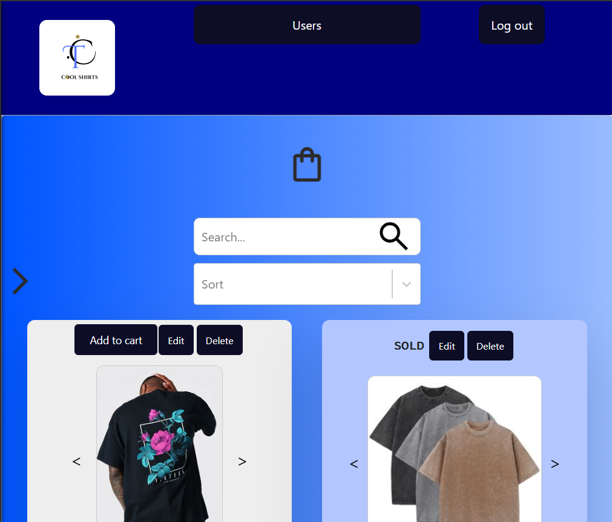
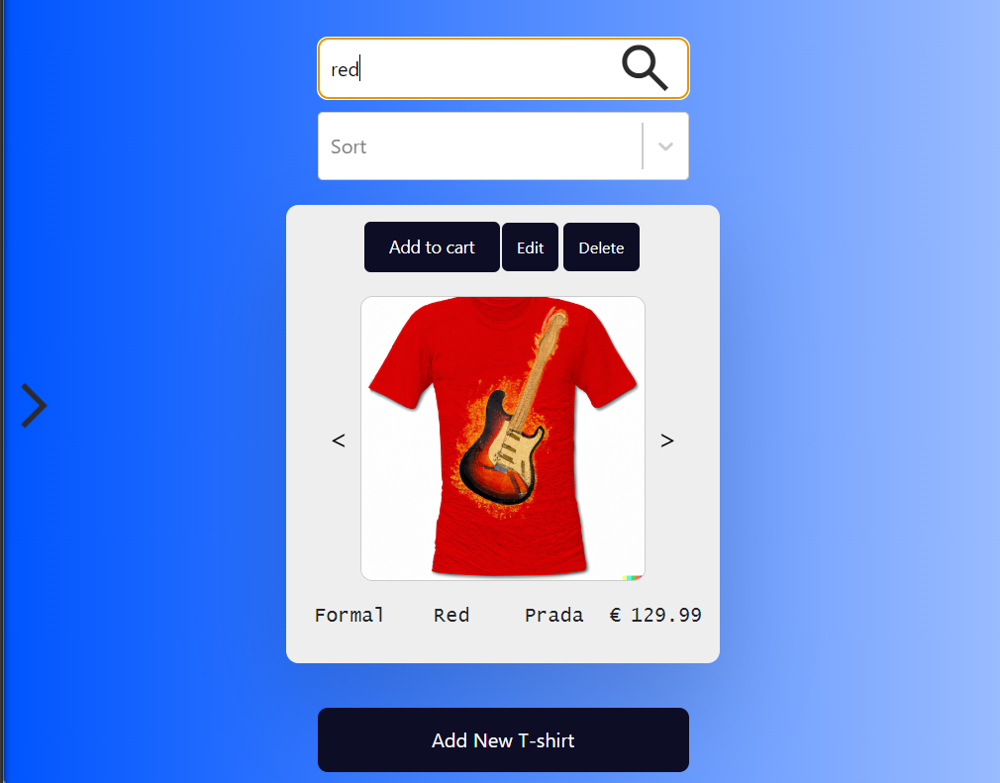
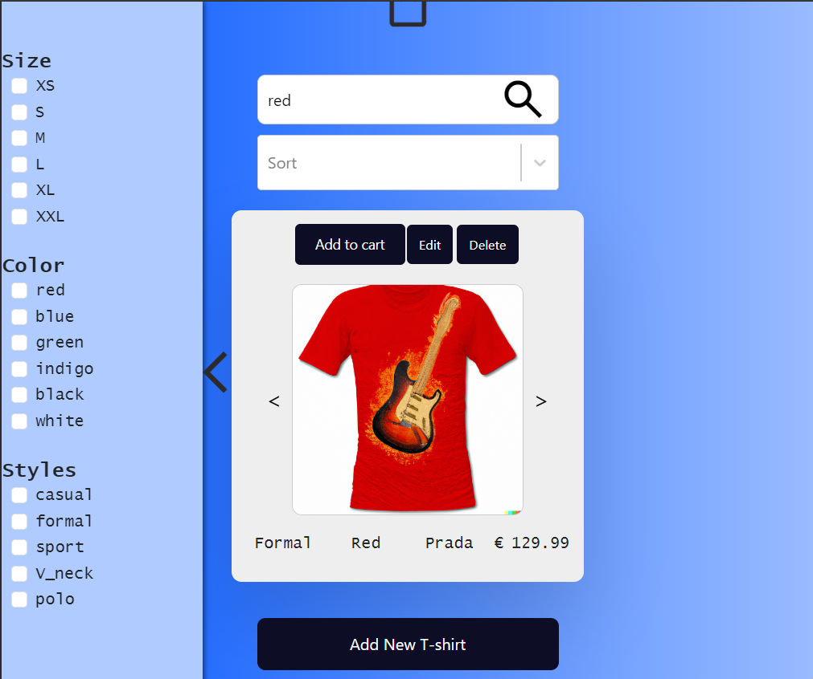

# Cool T-shirts

**Cool T-shirts** is a web application for an online t-shirt store. The site allows users to browse, add to cart, and purchase t-shirts. Administrators can manage products and users.

## Screenshots





## Features

- **Users**: User registration and login using JSON Web Tokens (JWT).
- **Products**: Administrators can add, edit, and delete products.
- **Purchases**: Add products to cart and checkout via PayPal.
- **Security**: Password encryption, .PEM certificate files for secure data transmission.
- **Profile Management**: Users can upload a profile image and edit their profile.
- **Client-side Validation**: User-friendly validation on the client-side.
- **Server-side Validation**: Router validation on the server-side.
- **Error Handling**: Middleware error handling for all server-side errors.

## Technologies Used

- **Front-end**: React, @syncfusion/ej2-react-inputs for data input.
- **Back-end**: Express, JSON Web Tokens for authentication.
- **Database**: MongoDB
- **Others**: Multer for file uploads, http-errors for error handling.

## Installation Requirements

- Node.js
- npm (Node Package Manager)
- MongoDB

## Installation and Setup Instructions

1. **Clone the repository:**
   ```bash
   git clone https://github.com/Roman-Manzhelii/Cool-T-shirts.git
   cd Cool-T-shirts
   ```

2. **Install dependencies:**
   - For the client:
     ```bash
     cd client
     npm install
     ```
   - For the server:
     ```bash
     cd server
     npm install
     ```

3. **Run the application:**
   ```bash
   npm start
   ```

## Usage Instructions

1. **Registration and Login:**
   - Register a new user or log in with an existing account.

2. **Browse Products:**
   - View available t-shirts and add them to your cart.

3. **Checkout:**
   - Proceed to checkout and pay via PayPal.

## Detailed Functionality

- **React Components**: All client-side code is implemented using React components.
- **Node/Express**: Used as the server-side technology.
- **RESTful API**: Routers implement a RESTful API for database access.
- **MongoDB**: Utilized for database management.

### You can do:

- Management of products with stock levels.
- Sorting, searching, and filtering of products.
- Multiple product images for each product.
- Shopping cart functionality.
- Payment processing.
- User login with JWT and .PEM certificates for session persistence.
- Profile image upload.
- Client-side validation.
- Server-side router validation.
- Middleware error handling.
- Localhost deployment.

### Access Levels

#### Administrator:
- View products
- Create new products
- Edit products
- Change product stock levels
- Delete products
- View users
- View users' previous purchase history
- Delete users

#### Logged-in User:
- View products
- Purchase products
- View previous purchase history
- Edit user profile and change profile image

#### Guest:
- View products
- Register a new user account and set up a new user profile

## Authors and Contact

Developed by [Roman Manzhelii](https://github.com/Roman-Manzhelii). For more information or questions, please contact via email: romamanzheliy1@gmail.com.